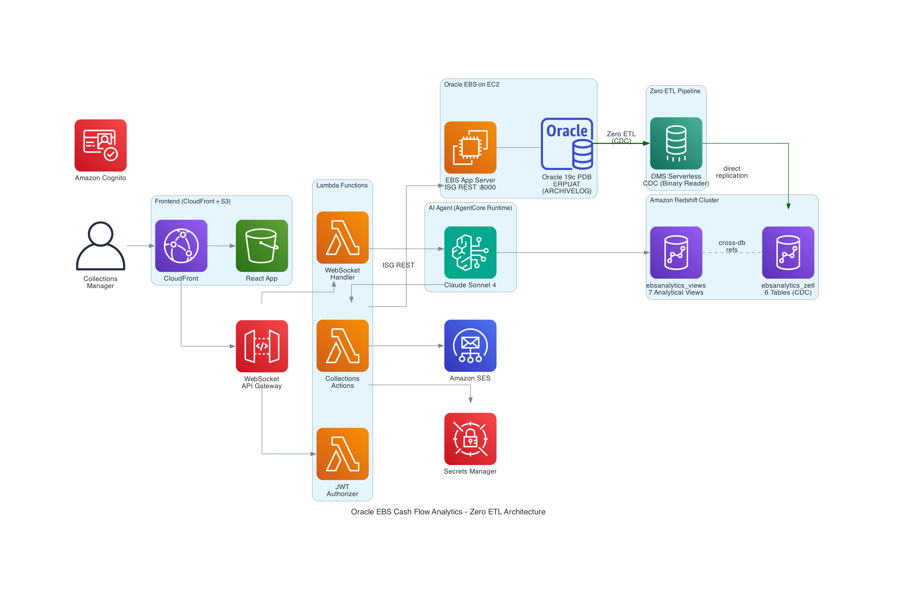

# Oracle EBS Cash Flow Analytics Platform

AI-powered collections management and cash flow analytics for Oracle E-Business Suite, built on AWS.

---

## What It Does

A conversational AI agent that lets collections teams query AR analytics and execute collections actions in Oracle EBS using natural language. Instead of navigating multiple EBS screens, a collections manager can go from insight to action in a single chat conversation:

* *"What is our current cash position?"* → Queries Amazon Redshift, returns overdue receivables with recommendations
* *"Show me our top 10 highest risk customers"* → Ranked list with overdue amounts and risk categories
* *"Place a credit hold on customer 1007"* → Writes directly to EBS via ISG REST, confirms in the same response
* *"Send a dunning letter to customer 1007"* → AI-generates the letter, stores as EBS note, emails via SES

The agent handles both read (analytics) and write (EBS actions) in the same conversation, with streaming responses so text appears in real-time as the agent thinks.

---

## Architecture



|Component|Technology|
|-|-|
|Frontend|React 18 + Amplify UI, CloudFront CDN, S3 static hosting|
|Authentication|Amazon Cognito (JWT, MFA support)|
|API|API Gateway WebSocket (real-time bidirectional streaming)|
|Agent|Amazon Bedrock AgentCore Runtime + Strands Agents SDK|
|LLM|Claude Sonnet 4 via Amazon Bedrock|
|Visualization|AgentCore Code Interpreter (matplotlib, pandas)|
|Data Warehouse|Amazon Redshift (8.6M+ rows, 6 tables, 7 analytical views)|
|Data Pipeline|AWS Zero ETL (DMS serverless CDC — Oracle → Amazon Redshift direct)|
|Collections Lambda|Python 3.11, VPC-attached, 10 actions|
|EBS Write-back|ISG REST (port 8000) via custom PL/SQL packages|
|Email|Amazon SES (dunning letters, payment reminders)|

---

## Prerequisites

* AWS account with Amazon Bedrock AgentCore access (us-east-1)
* Oracle EBS 12.2.x environment with ISG enabled
* Oracle DB in ARCHIVELOG mode with PK supplemental logging — see [Zero ETL Prerequisites](ZERO_ETL_PREREQUISITES.md) for detailed configuration
* Primary keys on all 6 target tables
* Python 3.12+ (for AgentCore CLI and setup scripts)
* Node.js 18+ (for frontend build)
* AWS CLI v2 configured with appropriate credentials
* AWS DMS source endpoint for Oracle EBS (with Binary Reader enabled for PDB environments)
* `agentcore` CLI installed (`pip install bedrock-agentcore-starter-toolkit`)

---

## Deployment

### Step 1: Configure

All environment-specific values are in a single config file. No account IDs, hostnames, or secrets are hardcoded in the scripts.

```bash
# Edit deploy-config.json with your account-specific values
vi deploy-config.json
```

Key values to set:

|Field|Description|Example|
|-|-|-|
|`aws_region`|AWS region|`us-east-1`|
|`stack_name`|CloudFormation stack name|`cash-flow-analytics`|
|`redshift.cluster_id`|Amazon Redshift cluster identifier|`oracle-ebs-redshift-zetl`|
|`redshift.database`|Amazon Redshift database name|`ebsanalytics`|
|`redshift.db_user`|Amazon Redshift admin user|`admin`|
|`oracle_ebs.host`|EBS application server IP|`10.0.1.68`|
|`oracle_ebs.port`|EBS ISG REST port|`8000`|
|`oracle_ebs.secret_name`|Secrets Manager secret for EBS credentials|`soa-ebiz-passwords`|
|`zero_etl.source_arn`|AWS Glue connection ARN for Oracle source|`arn:aws:glue:...`|
|`agentcore.model_id`|Bedrock model ID|`us.anthropic.claude-sonnet-4-20250514-v1:0`|
|`agentcore.execution_role`|IAM role ARN for AgentCore (leave empty to auto-create)||
|`vpc.vpc_id`|VPC ID of the EBiz environment|`vpc-0abc123...`|
|`vpc.subnet_ids`|Comma-separated private subnet IDs in the EBiz VPC (minimum 2, different AZs — required by Zero ETL)|`subnet-aaa,subnet-bbb`|
|`vpc.security_group_id`|Security group allowing outbound to EBS host and AWS services|`sg-0abc123...`|

### Step 2: Deploy Oracle EBS PL/SQL Packages and REST Services

Copy the `collections_agent/` folder to the EBS application server `$HOME` of `applmgr`. Then edit the deploy script to set your environment-specific values:

```bash
vi collections_agent/scripts/deploy_all_rest_services.sh
```

Replace the following placeholders:

|Placeholder|Description|Example|
|-|-|-|
|`__EBS_BASE__`|EBS application base path|`/fh01/ERPUAT`|

**Prerequisite: Integration Repository Parser Setup**

The iRep parser requires Perl modules (notably `Class::MethodMaker` v1.x) that ship as **Oracle Patch 13602850**. Per the [Oracle EBS 12.2 SOA Gateway Implementation Guide](https://docs.oracle.com/cd/E26401_01/doc.122/e20925/T511175T543269.htm):

```bash
# 1. Download Patch 13602850 (p13602850_R12_GENERIC.zip) from My Oracle Support
#    to a temp directory on the app server, e.g. /tmp/p13602850/

# 2. Source the EBS environment
. <EBS_BASE>/EBSapps.env run

# 3. Run the Oracle-provided setup script
perl $FND_TOP/patch/115/bin/IREPParserSetup.pl
# When prompted, provide the path: /tmp/p13602850
```

This is a one-time setup per app server. The setup script installs all required Perl modules correctly. Do NOT install `Class::MethodMaker` from CPAN — v2.x breaks `irep_parser.pl` compatibility.

Then run the deployment as `applmgr`:

```bash
. <EBS_BASE>/EBSapps.env run
chmod +x collections_agent/scripts/deploy_all_rest_services.sh
./collections_agent/scripts/deploy_all_rest_services.sh
```

The script will prompt for the APPS password and then:

1. Compile PL/SQL packages in the database
2. Register packages in iRep (irep_parser + FNDLOAD)
3. Deploy as REST services via iSG
4. Grant GLOBAL access
5. Verify WADL endpoints return HTTP 200

Without this step, all write-back actions will fail with `ISG_INVALID_ALIAS`.

### Step 3: Deploy Everything

```bash
chmod +x *.sh
./deploy.sh
```

This deploys all components (except Amazon Redshift views, which require Zero ETL replication to complete first):

|Stage|Target|What It Does|
|-|-|-|
|0|`secrets`|Creates Secrets Manager secret for EBS credentials (prompts for password if secret doesn't exist)|
|1|`infra`|Creates/updates CloudFormation stack (S3, CloudFront, Amazon Cognito, API Gateway, WebSocket, DynamoDB, S3 logging bucket, Lambda VPC config)|
|2|`lambda`|Packages and deploys the collections Lambda with env vars from config|
|3|`zero-etl`|Validates DMS/Amazon Redshift connectivity, creates the AWS Glue Zero-ETL integration, sets Amazon Redshift resource policy, and creates the target database (Oracle → Amazon Redshift)|
|4|`agent`|Generates agentcore config from deploy-config.json and runs `agentcore deploy`|
|5|`frontend`|Updates aws-config.js from stack outputs, builds React, syncs to S3, invalidates CloudFront|

### Step 4: Create Amazon Redshift Views (after Zero ETL replication)

After `./deploy.sh` completes, the Zero ETL integration automatically creates the Amazon Redshift database and begins replicating Oracle tables. The initial load takes 10–30 minutes depending on data volume. Monitor progress in the AWS Glue console (Zero-ETL integrations), then create the analytical views:

```bash
./deploy.sh views
```

The script checks that tables exist in Amazon Redshift before creating views. If replication hasn't finished, it will tell you to try again later.

You can also deploy individual components:

```bash
./deploy.sh secrets            # Create Secrets Manager secret only
./deploy.sh infra              # CloudFormation only
./deploy.sh lambda             # Lambda only
./deploy.sh views              # Amazon Redshift views only
./deploy.sh zero-etl           # Zero-ETL integration only
./deploy.sh agent              # AgentCore agent only
./deploy.sh frontend           # Frontend only
./deploy.sh infra lambda views # Multiple targets
```

### Teardown

To remove all deployed resources:

```bash
./destroy.sh                    # Interactive — prompts for confirmation
./destroy.sh --force            # Skip confirmation
./destroy.sh --delete-secrets   # Also delete the EBS credentials secret
```

The script tears down resources in the correct order: AWS Glue Zero-ETL integration → AgentCore runtime → S3 bucket contents → CloudFormation stack (Amazon Redshift, Lambda, Amazon Cognito, API GW, CloudFront) → optional Secrets Manager secret. Oracle EBS PL/SQL packages and Amazon Redshift automated snapshots are not touched.

### Step 5: Create Amazon Cognito User

After the stack deploys, create a user in the Amazon Cognito User Pool:

```bash
# Get the User Pool ID from stack outputs (printed by deploy.sh)
aws cognito-idp admin-create-user \
  --user-pool-id <USER_POOL_ID> \
  --username user@example.com \
  --temporary-password TempPass123! \
  --region us-east-1
```

### Step 6: Verify

The deploy script prints the CloudFront URL, WebSocket URL, and Amazon Cognito details. Open the CloudFront URL in a browser and sign in.

---

## Data Pipeline Patterns

Two data pipeline patterns have been tested and proven for Oracle EBS → Amazon Redshift replication.

|Pattern|Pipeline|Latency|Status|
|-|-|-|-|
|**1. Zero ETL**|**DMS serverless CDC → Amazon Redshift direct**|**Near-real-time**|**Production ✅**|
|2. GoldenGate|GG Extract → S3 (Avro) → Amazon Redshift COPY|~60-90 seconds|POC complete|

### Zero ETL (Primary)

* AWS Zero ETL (DMS serverless CDC) replicates directly from Oracle EBS to Amazon Redshift
* No S3 staging bucket required
* Near-real-time CDC — changes replicate automatically
* Tables are uppercase Oracle-case (`"AR"."AR_PAYMENT_SCHEDULES_ALL"`)
* Requires: ARCHIVELOG mode, PK supplemental logging, Binary Reader, primary keys on all tables

### Zero ETL Data Filter Syntax (Critical)

Each table MUST have its own `include:` prefix, comma-separated:

```
"include: ERPUAT.AR.HZ_CUST_ACCOUNTS, include: ERPUAT.PO.PO_HEADERS_ALL"
```

---

## Collections Actions

|#|Action|Type|What It Does|
|-|-|-|-|
|1|`get_overdue_customers`|READ|Query overdue AR from Amazon Redshift|
|2|`get_customer_details`|READ|Invoice drill-down by customer|
|3|`place_credit_hold`|WRITE|Set CREDIT_HOLD=Y via ISG REST|
|4|`release_credit_hold`|WRITE|Set CREDIT_HOLD=N via ISG REST|
|5|`create_collections_note`|WRITE|Log note in EBS (JTF_NOTES)|
|6|`apply_order_holds`|WRITE|Hold all open orders via OE_HOLDS_PUB|
|7|`release_order_holds`|WRITE|Release order holds|
|8|`create_collections_task`|WRITE|Create JTF follow-up task|
|9|`send_dunning_letter`|WRITE|AI-generated letter + EBS note + email + optional credit hold|
|10|`send_payment_reminder`|WRITE|HTML payment reminder email + EBS note|

All write-back actions use pure ISG REST via custom PL/SQL packages registered with iRep.

### Credit Hold Profile Resolution

Credit hold operations (`place_credit_hold`, `release_credit_hold`) require `cust_account_profile_id` and `object_version_number` from `HZ_CUSTOMER_PROFILES`. The Lambda resolves these automatically by calling `XxCollectionsRestPkg/get_customer_profile/` via ISG REST, which queries `HZ_CUSTOMER_PROFILES` directly. No manual pre-population or caching is required — the profile is fetched fresh from EBS on each call (~200-500ms).

---

## Analytical Views

Created by `setup_redshift_views.py` (or `./deploy.sh views`):

|View|Purpose|
|-|-|
|`current_cash_position`|Real-time cash position with overdue/due breakdowns|
|`ar_aging_analysis`|Aging buckets (OVERDUE, DUE_THIS_WEEK, DUE_THIS_MONTH, FUTURE)|
|`weekly_cash_flow_summary`|12-week inflows vs outflows with cumulative running total|
|`customer_payment_behavior`|Customer risk categorization (HIGH_RISK, HIGH_VALUE, NORMAL)|
|`liquidity_sufficiency_analysis`|Payroll and AP coverage ratios|
|`predictive_cash_flow_forecast`|12-week forecast with confidence levels|

---

## Project Structure

```
├── deploy-config.json                   # ← All environment-specific config (edit this)
├── deploy.sh                            # Unified deployment (6 stages)
├── setup_redshift_views.py              # Creates all 6 analytical views
├── setup_zero_etl.py                    # Creates AWS Glue Zero-ETL integration
│
├── agentcore_version/
│   ├── agent_strands.py                 # Strands SDK agent (deployed to AgentCore)
│   ├── agentcore.yaml                   # AgentCore deployment config (updated by deploy.sh)
│   ├── iam-policy-fixed.json            # IAM policy template (uses placeholders)
│   └── requirements.txt                 # Python dependencies
│
├── collections_agent/
│   ├── lambda/
│   │   └── ebs_collections_actions.py   # Collections Lambda (10 actions, ISG REST)
│   └── sql/                             # PL/SQL packages for EBS write-back
│
├── frontend/
│   ├── src/                             # React app
│   │   └── aws-config.js               # Auto-generated by deploy.sh from stack outputs
│   ├── lambda/                          # WebSocket + authorizer Lambdas
│   ├── infrastructure.yaml              # CloudFormation (all AWS resources)
│   └── package.json                     # React dependencies
│
├── README.md                            # This document
├── SOLUTION_GUIDE_V2.md                 # Solution guide
└── ZERO_ETL_PREREQUISITES.md            # Oracle DB + DMS + Redshift prerequisites
```

---

## Configuration Flow

All configuration flows from `deploy-config.json`:

```
deploy-config.json
  ├── deploy.sh reads config values
  │     ├── CloudFormation stack (infra)
  │     ├── Lambda env vars (CLUSTER_ID, DATABASE, EBS_HOST, SECRET_NAME, etc.)
  │     ├── agentcore.yaml (region, model, cluster, database)
  │     └── frontend/src/aws-config.js (from CloudFormation stack outputs)
  ├── setup_redshift_views.py reads config (cluster, database, user)
  ├── setup_zero_etl.py reads config (source ARN, target cluster)
  └── Standalone scripts fall back to env vars if no config file
```

Runtime code (Lambda, agent) reads from environment variables set during deployment. No config file is needed at runtime.

---

## How the Agent Works

The agent uses the [Strands Agents SDK](https://github.com/strands-agents/sdk-python):

1. User sends a natural language question via WebSocket
2. The Strands `Agent` receives the question with two `@tool` functions: `execute_redshift_query` and `execute_collections_action`
3. Claude autonomously decides which tools to call — no hardcoded routing
4. For analytics: the LLM writes SQL, calls Amazon Redshift, interprets results
5. For actions: the LLM invokes the collections Lambda via ISG REST
6. Responses stream back in real-time via `stream_async()` through AgentCore Runtime
7. The frontend displays text as it arrives with a blinking cursor animation

---

## Documentation

|Document|Description|
|-|-|
|[ZERO_ETL_PREREQUISITES.md](ZERO_ETL_PREREQUISITES.md)|Oracle DB, AWS DMS, and Amazon Redshift configuration for Zero ETL|


